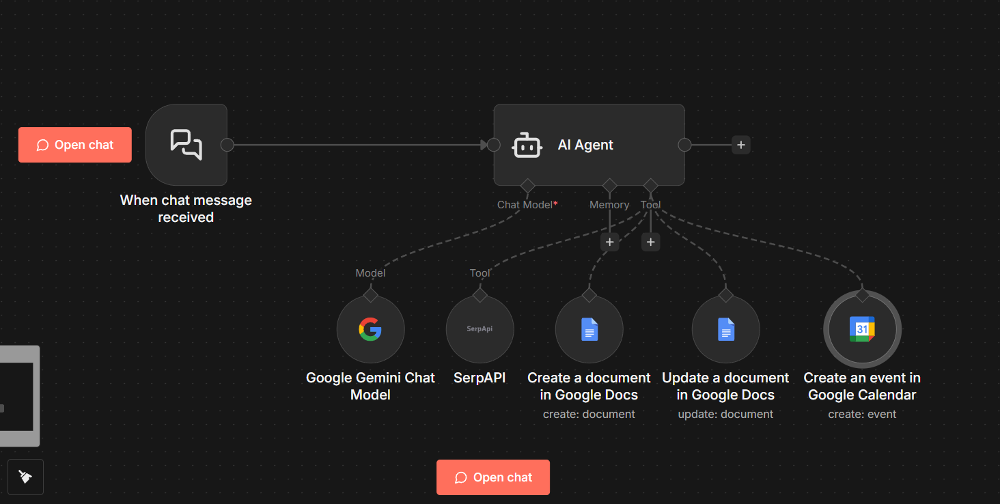

# ?? Learning Path Generator

A reusable **n8n** workflow that automates the creation of day-wise learning plans.  
When a user submits a topic and optional start date, the workflow:

1. **Plans a curriculum** spanning the requested number of days.
2. **Searches for resources** (YouTube videos, articles, docs) via SerpAPI.
3. **Creates a Google Doc** containing the full schedule and links.
4. **Schedules Google Calendar events** (2-hour blocks at 11?AM?�?1?PM) for each day.

> Entire process is driven by an AI agent (Google Gemini) and can be triggered from chat.

---

## ??? Folder contents


- **`template.json`** � the n8n workflow definition.
- **`template.png`** � visual preview of the workflow.
- **`README.MD`** � this file (currently empty).

---

## ?? Use cases

This workflow shines in scenarios where you need to:

- Quickly build a structured learning schedule for yourself, a student, or a team.
- Turn an informal goal (�learn React in 5 days�, �Python data science path�) into
  documented curriculum plus calendar reminders.
- Combine AI planning with real-world research and calendar/doc integrations.
- Provide a shareable Google Doc and calendar invite series with minimal manual effort.

---

## ?? How it works

1. **Trigger**  
   The workflow begins when a chat message arrives (LangChain `chatTrigger` node).

2. **AI agent logic**  
   An `agent` node runs custom instructions (the large system message in
   `template.json`) that:
   - Parse the goal and any date hints.
   - Plan daily topics from beginner to advanced.
   - Call tools sequentially (SerpAPI, Google Docs, Google Calendar).

3. **Resource gathering**  
   SerpAPI is used 2�3 times to fetch relevant URLs for each day�s topic.

4. **Document creation**  
   A single Google Doc is created and then updated with every day�s schedule.

5. **Calendar events**  
   Events are generated one per day at 11?AM?�?1?PM (timezone +05:30).

6. **Final output**  
   The agent returns:
   ```
   Learning Path Complete!
   Document: [Google Docs URL]
   Calendar: I've added [X] events from [START_DATE] to [END_DATE] at 11:00 AM.
   Your [X]-day [topic] learning journey is ready!
   ```

---

## ? Prerequisites

- An **n8n** instance (self-hosted or cloud).
- Credentials configured for:
  - Google Gemini (PaLM) or another LLM.
  - SerpAPI.
  - Google Docs OAuth2.
  - Google Calendar OAuth2.
- The workflow imported from `template.json`.

---

## ?? Customization tips

- Adjust the default event time or timezone in the calendar node.
- Modify the system message to change planning rules (e.g. more days, alternate format).
- Swap out SerpAPI for another search tool by editing the agent�s instructions.

---

## ?? Extending or integrating

You can embed this workflow into larger automation pipelines, e.g.:

- Prepend a form node to collect topic/date from users.
- Postprocess the Google Doc for branding or sharing links.
- Trigger the workflow via webhooks from external systems.


> **Pro tip:** Keep the `template.json` under version control; it�s easy to re-import
> whenever you spin up a new n8n environment.

---

Feel free to edit or expand this README with screenshots, examples, or additional
setup notes as your project evolves!
