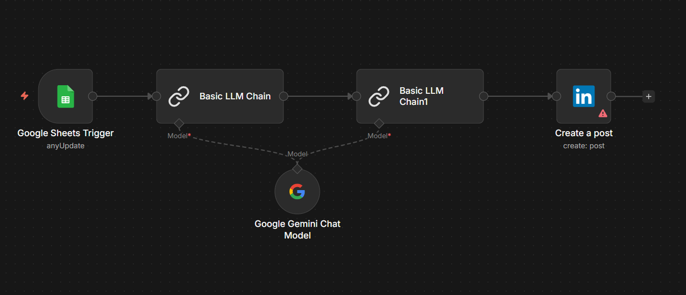

# Social Media Automation Workflow

This repository contains an [n8n](https://n8n.io/) automation designed to simplify and streamline the creation and posting of social media content, specifically targeting LinkedIn. The workflow leverages Google Sheets for input, an LLM for content summarization and drafting, and a LinkedIn node to publish posts automatically.

## Overview

The automation consists of the following key steps:

1. **Google Sheets Trigger**
   - Listens for new rows or updates in a Google Sheet (`Social Media Workflow` spreadsheet).
   - The sheet is expected to contain article links or summaries that will be processed.

2. **LLM Processing**
   - Uses a LangChain `Basic LLM Chain` to analyze the article or summary provided in the sheet.
   - The first chain generates a short, social-media-friendly summary of the article, focusing on three main insights, actionable advice, tone preservation, and audience implications.
   - A second chain takes that summary and drafts a LinkedIn post with professional analysis, industry trends, and a call-to-action.
   - The workflow uses the Google Gemini Chat Model (via PaLM API) as the language model backend.

3. **LinkedIn Post Creation**
   - The generated post content is sent to the `Create a post` LinkedIn node, which publishes it to a connected LinkedIn account using OAuth2 credentials.

## Files 
- `template.json` – The exported n8n workflow configuration. Import this into your n8n instance to recreate the automation.
- `README.md` – This documentation file (you are reading it now).

## Setup Instructions

1. **Google Sheets**
   - Create a Google Spreadsheet named `Social Media Workflow` or update the `documentId` in the workflow to point to your sheet.
   - Add your Google account credentials to n8n and authorize the `Google Sheets Trigger` node.

2. **LLM Configuration**
   - Add your Google Gemini (PaLM) API credentials to n8n and connect them to the `Google Gemini Chat Model` node.
   - Optionally adjust the prompts in the `Basic LLM Chain` nodes to suit your style or audience.

3. **LinkedIn Credentials**
   - Provide OAuth2 credentials for a LinkedIn account in n8n and link them to the `Create a post` node.

4. **Import Workflow**
   - In n8n, go to *Workflows > Import*, paste or upload the contents of `template.json`, and activate the workflow.

## Customization

- Modify the Google Sheets trigger to use different polling intervals or filter conditions.
- Change the prompts or add additional chains to support other social platforms.
- Extend the workflow with error handling, logging, or multi-platform publishing.

## License

This workflow is provided `as-is` under the terms of the [MIT License](../LICENSE).

---

Feel free to tweak the process to fit your content pipeline or expand it for broader automation across social networks.
